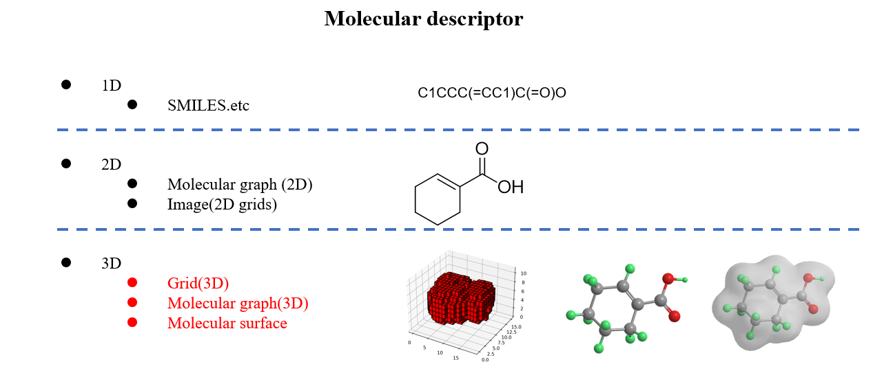

# 3D Geometry Deep Learning in Drugs

related to  **Geometric Deep Learning** and **3D** for  **Drugs**.

**Updating ...**  

## Menu

- [3D Geometry Deep Learning in Drugs](#3d-geometry-deep-learning-in-drugs)
  - [Menu](#menu)
  - [Reviews](#reviews)
  - [Datasets and Benchmarks](#datasets-and-benchmarks)
    - [Datasets](#datasets)
    - [Benchmarks](#benchmarks)
  - [Small molecular application](#small-molecular-application)
    - [Property prediction](#property-prediction)
    - [Molecular conformation generation](#molecular-conformation-generation)
    - [Molecular generation](#molecular-generation)
  - [Macro-molecular application](#macro-molecular-application)
    - [Property prediction](#property-prediction-1)
    - [Binding sites prediction](#binding-sites-prediction)
    - [Bindding score prediction](#bindding-score-prediction)
    - [Bindding conformation prediction](#bindding-conformation-prediction)
    - [Structure-based drug design](#structure-based-drug-design)

## Reviews

* **Structure-based drug design with geometric deep learning**[2023]  
[[Paper]](https://doi.org/10.1016/j.sbi.2023.102548)

* **MolGenSurvey: A Systematic Survey in Machine Learning Models for Molecule Design**[2022]  
[[Paper]](https://arxiv.org/abs/2203.14500)

* **Geometrically Equivariant Graph Neural Networks: A Survey**[2022]  
[[Paper]](https://arxiv.org/abs/2202.07230)

* **Geometric Deep Learning: Grids, Groups, Graphs, Geodesics, and Gauges**[2021]  
[[Paper]](https://arxiv.org/abs/2104.13478)

* **Geometric deep learning on molecular representations**[2021]  
[[Paper]](https://arxiv.org/abs/2107.12375)

## Datasets and Benchmarks

### Datasets

**QM dataset**

http://quantum-machine.org/datasets/

**Qmugs**

https://www.nature.com/articles/s41597-022-01390-7

**GEOM**

https://www.nature.com/articles/s41597-022-01288-4

**OC20**

https://github.com/Open-Catalyst-Project/ocp/blob/main/DATASET.md

**PDBBIND**

http://pdbbind.org.cn/ 

**DIPS**

https://github.com/drorlab/DIPS

### Benchmarks

## Small molecular application
### Property prediction
### Molecular conformation generation
### Molecular generation

## Macro-molecular application
### Property prediction
### Binding sites prediction  
* **ScanNet: an interpretable geometric deeplearning model for structure-based proteinbinding site prediction** [2022]   
Tubiana, Jérôme, Schneidman-Duhovny, Dina, Wolfson, Haim J.  
[paper](https://www.nature.com/articles/s41592-022-01490-7) | [code](https://github.com/jertubiana/ScanNet)    
* **Geometric Transformers for Protein Interface Contact Prediction** [2022]  
Alex Morehead, Chen Chen, Jianlin Cheng.  
[paper](https://arxiv.org/abs/2110.02423) | [code](https://github.com/BioinfoMachineLearning/DeepInteract)  
* **Fast end-to-end learning on protein surfaces** [2021]  
Freyr Sverrisson, Jean Feydy, Bruno E Correia, Michael M Bronstein.     
[paper](https://ieeexplore.ieee.org/document/9577686) | [code](https://github.com/FreyrS/dMaSIF)  
* **Deciphering interaction fingerprints from protein molecular surfaces using geometric deep learning** [2020]  
Gainza et al.  
[paper](https://www.nature.com/articles/s41592-019-0666-6) | [code](https://github.com/lpdi-epfl/masif)  
* **DeepSite: protein-binding site predictor using 3D-convolutional neural networks** [2017]  
Jiménez et al.  
[paper](https://pubmed.ncbi.nlm.nih.gov/28575181/)

### Bindding score prediction
### Bindding conformation prediction
### Structure-based drug design
* **Equivariant 3D-Conditional Diffusion Models for Molecular Linker Design** [2022]   
Ilia Igashov et al.
[paper](https://arxiv.org/abs/2210.05274) | [code](https://github.com/igashov/DiffLinker)  
* **3DLinker: An E(3) Equivariant Variational Autoencoder for Molecular Linker Design** [2022]   
Yinan Huang, Xingang Peng, Jianzhu Ma, Muhan Zhang.  
[paper](https://proceedings.mlr.press/v162/huang22g.html) | [code](https://github.com/YinanHuang/3DLinker)  
* **ScanNet: an interpretable geometric deeplearning model for structure-based proteinbinding site prediction** [2022]   
Tubiana, Jérôme, Schneidman-Duhovny, Dina, Wolfson, Haim J.  
[paper](https://www.nature.com/articles/s41592-022-01490-7) | [code](https://github.com/jertubiana/ScanNet)  
* **ScanNet: an interpretable geometric deeplearning model for structure-based proteinbinding site prediction** [2022]   
Tubiana, Jérôme, Schneidman-Duhovny, Dina, Wolfson, Haim J.  
[paper](https://www.nature.com/articles/s41592-022-01490-7) | [code](https://github.com/jertubiana/ScanNet)  
* **ScanNet: an interpretable geometric deeplearning model for structure-based proteinbinding site prediction** [2022]   
Tubiana, Jérôme, Schneidman-Duhovny, Dina, Wolfson, Haim J.  
[paper](https://www.nature.com/articles/s41592-022-01490-7) | [code](https://github.com/jertubiana/ScanNet)  
* **ScanNet: an interpretable geometric deeplearning model for structure-based proteinbinding site prediction** [2022]   
Tubiana, Jérôme, Schneidman-Duhovny, Dina, Wolfson, Haim J.  
[paper](https://www.nature.com/articles/s41592-022-01490-7) | [code](https://github.com/jertubiana/ScanNet)  
* **ScanNet: an interpretable geometric deeplearning model for structure-based proteinbinding site prediction** [2022]   
Tubiana, Jérôme, Schneidman-Duhovny, Dina, Wolfson, Haim J.  
[paper](https://www.nature.com/articles/s41592-022-01490-7) | [code](https://github.com/jertubiana/ScanNet)  
* **ScanNet: an interpretable geometric deeplearning model for structure-based proteinbinding site prediction** [2022]   
Tubiana, Jérôme, Schneidman-Duhovny, Dina, Wolfson, Haim J.  
[paper](https://www.nature.com/articles/s41592-022-01490-7) | [code](https://github.com/jertubiana/ScanNet)  